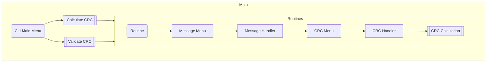

# Cyclic Redundancy Check (CRC) Simulator

Anakin B., Ethan W., Sean R.

## Usage

The CLI application can be run with:

```sh
python crc_cli.py
# Use python3 on Linux
```

This will start the main menu.

```
==== MAIN MENU ====
Please enter the menu item number followed by enter (e.g. h).

1 - CRC calculation
2 - CRC validation
3 - Credits
h - Information
q - Quit
```

The program can be navigated by inputting the character before the `-`, e.g. `1` and then `enter`. At anytime, `q` will return to a previous menu, or exit the program if in the main menu. For convenience, the application will store the last used message/codeword and divisor which can be selected on `0` if available.

For the purposes of demonstrating the calculation of a CRC, each step of the calculation is shown and laid out in the terminal as you would do by hand.

For example with the message `1010011` and:
```
Divisor:    CRC-8
Binary:     111010101
Polynomial: x^8 + x^7 + x^6 + x^4 + x^2 + 1
```
We get:
```
Calculating CRC code:
101001100000000
111010101       XOR
---------
0100110010
 111010101      XOR
 ---------
 0111001110
  111010101     XOR
  ---------
  0000110110000
      111010101 XOR
      ---------
      001100101 Done

CRC Code:        01100101
Codeword: 101001101100101
```

A similar process will occur for validation, however, the program will look for a division remainder of 0 to signify that the data contains no detectable errors.

### CRC Standards
The application allows the user to select a CRC standard to use as the divisor. The standards currently programmed in are:

1. CRC-16
2. CRC-16-CCITT
3. CRC-12
4. CRC-32
5. CRC-8
6. CRC-1 (Parity bit)

The user may also enter their own CRC if they so wish.

## Application Flow
The sub-routines Calculate CRC and Validate CRC follow a general flow from routine to calculation as such:

